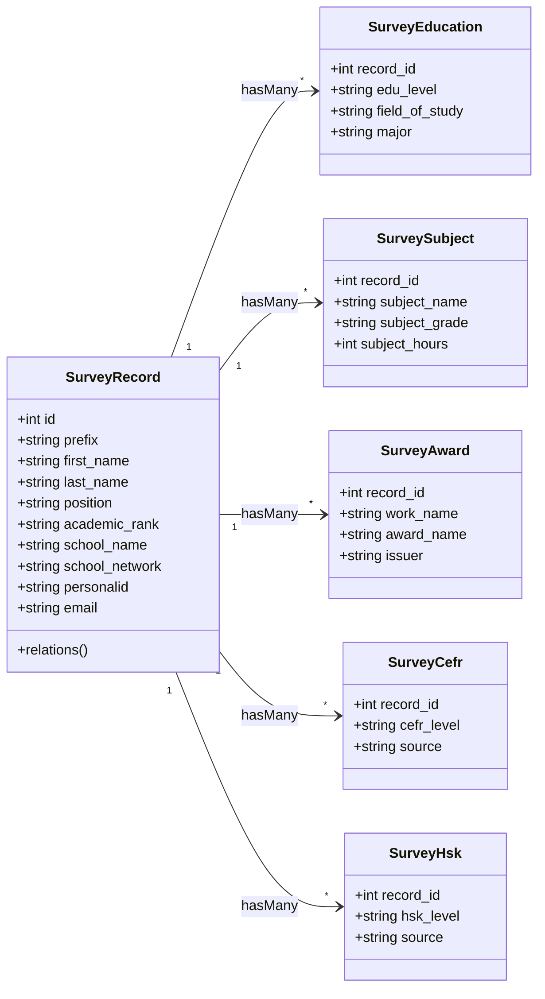

# แผนการบูรณาการระบบรายงานและแดชบอร์ดข้อมูลบุคลากรเข้าสู่ Laravel 11 (ฉบับปรับปรุง)

แผนงานนี้จัดทำขึ้นเพื่อย้ายระบบแสดงข้อมูลรายงานบุคลากร (`report.php`), แดชบอร์ดสถิติ (`dashboard.php`) และข้อมูลเจาะลึก (`dashboard_drilldown.php`) จากสคริปต์ PHP รูปแบบเดิม เข้ามาอยู่ในโครงสร้าง **Laravel 11** ของเว็บไซต์ในปัจจุบัน โดยจะยังคงฟังก์ชันการวิเคราะห์ข้อมูลและเงื่อนไขทั้งหมดไว้ แต่เปลี่ยนดีไซน์ UX/UI ให้เข้ากับระบบปัจจุบัน รวมถึงรองรับระบบแบบ **SPA (No-Page-Refresh)** ที่ใช้การควบคุมจาก Alpine.js และสื่อสารผ่าน Axios API ตามมาตรฐานระบบในปัจจุบัน

---

## 1. สถาปัตยกรรมข้อมูลและการออกแบบ Models

ในระบบเดิมมีการบันทึกข้อมูลกระจายอยู่ 6 ตาราง ซึ่งเราจะนำมาแมปเข้าสู่ Laravel Eloquent Models ดังนี้:

### 1.1 การสร้าง Models และ Relationships
เราจะสร้าง 6 โมเดลหลัก และกำหนดความสัมพันธ์ (Relationships) เพื่อช่วยให้ดึงข้อมูลแบบ Eager Loading (`with()`) ได้รวดเร็วและไม่เกิดปัญหา N+1 Query:



#### ตัวอย่าง Model `SurveyRecord` (`app/Models/SurveyRecord.php`):
```php
<?php

namespace App\Models;

use Illuminate\Database\Eloquent\Model;
use Illuminate\Database\Eloquent\Relations\HasMany;
use Illuminate\Database\Eloquent\Relations\HasOne;

class SurveyRecord extends Model
{
    protected $table = 'survey_records';
    protected $fillable = [
        'prefix', 'first_name', 'last_name', 'position', 'academic_rank',
        'school_code', 'school_name', 'school_network', 'recruitment_subject',
        'birth_date', 'birth_year_be', 'age', 'appointed_date', 'appointed_year_be',
        'personalid', 'email', 'profile_image_url', 'profile_image_path'
    ];

    public function educations(): HasMany {
        return $this->hasMany(SurveyEducation::class, 'record_id');
    }

    public function subjects(): HasMany {
        return $this->hasMany(SurveySubject::class, 'record_id');
    }

    public function awards(): HasMany {
        return $this->hasMany(SurveyAward::class, 'record_id');
    }

    public function cefr(): HasMany {
        return $this->hasMany(SurveyCefr::class, 'record_id');
    }

    public function hsk(): HasMany {
        return $this->hasMany(SurveyHsk::class, 'record_id');
    }

    // สำหรับเชื่อมข้อมูลผู้ใช้งานกับระบบ LMS ของเว็บปัจจุบัน
    public function systemUser(): HasOne {
        return $this->hasOne(User::class, 'personalid', 'personalid')
            ->orWhere('email', $this->email);
    }
}
```

> [!NOTE]
> ในทำนองเดียวกัน จะมีการสร้าง Model ของ `SurveyEducation`, `SurveySubject`, `SurveyAward`, `SurveyCefr`, และ `SurveyHsk` โดยกำหนด `$table` และความสัมพันธ์ `belongsTo` กลับมาที่ `SurveyRecord`

---

## 2. พอร์ตระบบวิเคราะห์ความสอดคล้องวิชาเอก (Alignment Service)

การคำนวณคะแนนและระดับความสอดคล้องระหว่างวิชาเอกของครูและวิชาที่สอนในชั้นเรียนจริงเป็นฟีเจอร์สำคัญของระบบเดิม เราจะทำการแยกฟังก์ชันการประมวลผลนี้ไปสร้างเป็น Service คลาสเดี่ยวเพื่อให้ง่ายต่อการทดสอบและนำไปใช้ซ้ำ

#### ไฟล์บริการประเมินความสอดคล้อง (`app/Services/SurveyAlignmentService.php`):
```php
<?php

namespace App\Services;

class SurveyAlignmentService
{
    public static function normalize(string $text): string
    {
        $text = mb_strtolower(trim($text), 'UTF-8');
        $text = preg_replace('/[^\p{L}\p{N}\s]/u', ' ', $text);
        $text = preg_replace('/\s+/u', ' ', $text);
        return trim((string)$text);
    }

    public static function extractCategories(string $text): array
    {
        $normalized = self::normalize($text);
        if ($normalized === '') return [];

        $keywords = [
            'thai' => ['ภาษาไทย', 'thai'],
            'math' => ['คณิต', 'mathematics', 'math'],
            'science' => ['วิทยาศาสตร์', 'วิทย์', 'ชีว', 'เคมี', 'ฟิสิก', 'science', 'biology', 'chemistry', 'physics'],
            'english' => ['อังกฤษ', 'english'],
            'social' => ['สังคม', 'ประวัติศาสตร์', 'ภูมิศาสตร์', 'หน้าที่พลเมือง', 'social'],
            'health_pe' => ['พลศึกษา', 'สุขศึกษา', 'พละ', 'physical education', 'health'],
            'art' => ['ศิลปะ', 'ดนตรี', 'นาฏศิลป์', 'art', 'music'],
            'career_tech' => ['การงานอาชีพ', 'งานอาชีพ', 'คอมพิวเตอร์', 'เทคโนโลยี', 'ict', 'coding', 'computer', 'technology'],
            'early_childhood' => ['ปฐมวัย', 'อนุบาล', 'early childhood'],
            'special_edu' => ['การศึกษาพิเศษ', 'special education'],
            'foreign_lang' => ['ภาษาจีน', 'ภาษาญี่ปุ่น', 'ภาษาเกาหลี', 'ภาษาฝรั่งเศส', 'ภาษาเยอรมัน', 'chinese', 'japanese', 'korean', 'french', 'german'],
        ];

        $matched = [];
        foreach ($keywords as $category => $words) {
            foreach ($words as $word) {
                if (mb_strpos($normalized, self::normalize($word), 0, 'UTF-8') !== false) {
                    $matched[$category] = true;
                    break;
                }
            }
        }
        return array_keys($matched);
    }

    public static function getLabel(string $category): string
    {
        $labels = [
            'thai' => 'ภาษาไทย', 'math' => 'คณิตศาสตร์', 'science' => 'วิทยาศาสตร์',
            'english' => 'ภาษาอังกฤษ', 'social' => 'สังคมศึกษา', 'health_pe' => 'สุขศึกษา/พลศึกษา',
            'art' => 'ศิลปะ/ดนตรี/นาฏศิลป์', 'career_tech' => 'การงานอาชีพ/คอมพิวเตอร์',
            'early_childhood' => 'ปฐมวัย', 'special_edu' => 'การศึกษาพิเศษ', 'foreign_lang' => 'ภาษาต่างประเทศอื่น',
        ];
        return $labels[$category] ?? $category;
    }

    public static function evaluate(array $educations, array $subjects): array
    {
        $majorTexts = [];
        foreach ($educations as $edu) {
            $combined = trim(($edu['field_of_study'] ?? '') . ' ' . ($edu['major'] ?? ''));
            if ($combined !== '') $majorTexts[] = $combined;
        }

        $subjectTexts = [];
        foreach ($subjects as $sub) {
            $name = trim($sub['subject_name'] ?? '');
            if ($name !== '') $subjectTexts[] = $name;
        }

        if (empty($majorTexts) || empty($subjectTexts)) {
            return [
                'status' => 'insufficient', 'label' => 'ข้อมูลไม่เพียงพอ',
                'description' => 'ต้องมีทั้งข้อมูลสาขา/วิชาเอก และรายวิชาที่สอน จึงจะประเมินได้',
                'score' => 0, 'matchedLabels' => [], 'unmatchedMajorLabels' => [],
            ];
        }

        $majorCats = [];
        foreach ($majorTexts as $t) {
            foreach (self::extractCategories($t) as $cat) $majorCats[$cat] = true;
        }

        $subCats = [];
        foreach ($subjectTexts as $t) {
            foreach (self::extractCategories($t) as $cat) $subCats[$cat] = true;
        }

        if (empty($majorCats) || empty($subCats)) {
            return [
                'status' => 'insufficient', 'label' => 'ข้อมูลไม่เพียงพอ',
                'description' => 'ระบบยังไม่พบหมวดวิชาที่ชัดเจนจากข้อมูลที่กรอก',
                'score' => 0, 'matchedLabels' => [], 'unmatchedMajorLabels' => [],
            ];
        }

        $majorKeys = array_keys($majorCats);
        $subKeys = array_keys($subCats);
        $matched = array_values(array_intersect($majorKeys, $subKeys));
        $unmatched = array_values(array_diff($majorKeys, $subKeys));

        $score = (int)round((count($matched) / max(1, count($majorKeys))) * 100);

        if ($score >= 70) {
            $status = 'good'; $label = 'สอดคล้องสูง';
            $description = 'วิชาที่สอนมีความสอดคล้องกับสาขา/วิชาเอกค่อนข้างสูง';
        } elseif ($score > 0) {
            $status = 'partial'; $label = 'สอดคล้องบางส่วน';
            $description = 'พบความสอดคล้องบางรายวิชา แต่อาจมีวิชาที่สอนนอกสาขา';
        } else {
            $status = 'low'; $label = 'ยังไม่สอดคล้อง';
            $description = 'ยังไม่พบความเชื่อมโยงชัดเจนระหว่างวิชาเอกกับวิชาที่สอน';
        }

        return [
            'status' => $status, 'label' => $label, 'description' => $description, 'score' => $score,
            'matchedLabels' => array_map([self::class, 'getLabel'], $matched),
            'unmatchedMajorLabels' => array_map([self::class, 'getLabel'], $unmatched),
        ];
    }
}
```

---

## 3. โครงสร้างระบบ Routing และ API Design

เพื่อให้สอดคล้องกับโครงสร้าง API แบบไม่มีการรีโหลดหน้าเว็บ (SPA-like) ตามข้อตกลงของโครงการ เราจะลงทะเบียน Routing ทั้งหมดใน `routes/web.php` ดังนี้:

### 3.1 การประกาศ Routes (`routes/web.php`)
```php
use App\Http\Controllers\Admin\SurveyReportController;
use App\Http\Controllers\Admin\SurveyDashboardController;

// กลุ่มสำหรับผู้ที่เข้าสู่ระบบแล้วทุกคน (ครู, สมาชิก, แอดมิน)
Route::middleware(['auth'])->group(function () {
    // ── รายงานข้อมูลบุคลากรทั้งหมด (Report) ──
    Route::get('/reports', [SurveyReportController::class, 'index'])->name('reports.index');
    Route::get('/reports/data', [SurveyReportController::class, 'getData'])->name('reports.data');

    // ── แดชบอร์ดสรุปผลสถิติ (Dashboard) ──
    Route::get('/dashboard/survey', [SurveyDashboardController::class, 'index'])->name('dashboard.survey.index');
    Route::get('/dashboard/survey/data', [SurveyDashboardController::class, 'getStats'])->name('dashboard.survey.stats');

    // ── รายงานเจาะลึกรายหมวดหมู่สถิติ (Drilldown) ──
    Route::get('/dashboard/survey/drilldown', [SurveyDashboardController::class, 'drilldown'])->name('dashboard.survey.drilldown');
    Route::get('/dashboard/survey/drilldown/data', [SurveyDashboardController::class, 'getDrilldownData'])->name('dashboard.survey.drilldown.data');
});

// กลุ่มจัดการข้อมูลเฉพาะผู้ดูแลระบบ (Admin เท่านั้น)
Route::middleware(['auth', 'role:admin'])->group(function () {
    Route::get('/reports/export', [SurveyReportController::class, 'exportExcel'])->name('reports.export');
    Route::delete('/reports/{id}', [SurveyReportController::class, 'destroy'])->name('reports.delete');
    
    // จัดการ Banners & Announcements ดั้งเดิมในหน้า Dashboard
    Route::post('/dashboard/survey/announcement', [SurveyDashboardController::class, 'saveAnnouncement'])->name('dashboard.survey.announcement.save');
    Route::post('/dashboard/survey/banners', [SurveyDashboardController::class, 'saveBanner'])->name('dashboard.survey.banner.save');
    Route::delete('/dashboard/survey/banners/{id}', [SurveyDashboardController::class, 'deleteBanner'])->name('dashboard.survey.banner.delete');
    Route::post('/dashboard/survey/banners/order', [SurveyDashboardController::class, 'reorderBanners'])->name('dashboard.survey.banner.order');
});
```

### 3.2 การปรับปรุงปุ่มเมนูบน Navbar
เปลี่ยนเมนู "ข้อมูลบุคลากร" ใน [layout.blade.php](file:///C:/inetpub/wwwroot/ee.cpn1.go.th/resources/views/components/layout.blade.php) จากเดิมที่ชี้ไปที่โครงสร้างคณะกรรมการศูนย์ (`route('org.public')` หรือ `/org`) ให้ชี้ไปที่หน้าสืบค้นข้อมูลบุคลากรใหม่ตัวนี้แทน:
- **ปุ่มแบบปกติ (Desktop)**: เปลี่ยนจาก `href="{{ route('org.public') }}"` เป็น `href="{{ route('reports.index') }}"`
- **ปุ่มแบบมือถือ (Mobile)**: เปลี่ยนจาก `href="{{ route('org.public') }}"` เป็น `href="{{ route('reports.index') }}"`

> [!IMPORTANT]
> ระบบรายงานใหม่นี้จำเป็นต้องผ่านการยืนยันตัวตนก่อนเข้าชม หากมีผู้ใช้งานทั่วไปที่ไม่ได้ล็อกอินคลิกลิงก์ดังกล่าว Laravel Middleware `auth` จะทำการเปลี่ยนเส้นทาง (Redirect) ไปหน้าเข้าสู่ระบบอัตโนมัติ และจะพากลับมาแสดงผลหน้ารายงานทันทีหลังลงชื่อเข้าใช้สำเร็จ

---

## 4. โครงสร้าง Controllers (Laravel backend)

เพื่อความกระชับและรองรับการส่งออกข้อมูลที่รวดเร็ว เราจะสร้างคอนโทรลเลอร์สองชุดหลักสำหรับประมวลผลข้อมูลส่งให้ Client-side:

### 4.1 SurveyReportController (`app/Http/Controllers/Admin/SurveyReportController.php`)
ทำหน้าที่ส่งหน้า Blade View ในครั้งแรก และส่งข้อมูล JSON คืนกลับมาในรูปแบบ API เมื่อมีการ กรอง ค้นหา หรือสลับหน้า:

```php
<?php

namespace App\Http\Controllers\Admin;

use App\Http\Controllers\Controller;
use App\Models\SurveyRecord;
use App\Services\SurveyAlignmentService;
use Illuminate\Http\JsonResponse;
use Illuminate\Http\Request;
use Illuminate\Support\Facades\DB;

class SurveyReportController extends Controller
{
    public function index()
    {
        return view('admin.reports'); // ส่งหน้าโครงสร้างหลักสไตล์พรีเมียม
    }

    public function getData(Request $request): JsonResponse
    {
        try {
            $query = SurveyRecord::with(['educations', 'subjects', 'awards', 'cefr', 'hsk']);

            // ── ตัวกรองข้อมูล (Filters) ──
            if ($request->filled('q_name')) {
                $name = $request->q_name;
                $query->where(function ($q) use ($name) {
                    $q->where('first_name', 'like', "%{$name}%")
                      ->orWhere('last_name', 'like', "%{$name}%")
                      ->orWhere(DB::raw("CONCAT(first_name, ' ', last_name)"), 'like', "%{$name}%");
                });
            }

            if ($request->filled('q_school')) {
                $query->where('school_name', 'like', "%{$request->q_school}%");
            }

            if ($request->filled('q_network')) {
                $query->where('school_network', 'like', "%{$request->q_network}%");
            }

            // แบ่งหน้าแสดงผล 8 คนต่อหน้า
            $paginator = $query->orderBy('id', 'desc')->paginate(8);

            // เช็คว่าผู้ใช้งานที่เข้าถึงเป็นผู้ดูแลระบบ (Admin) หรือไม่
            $isAdmin = auth()->user() && auth()->user()->role === 'admin';

            // ── การประมวลผลข้อมูลร่วมกับระบบหลัก (LMS & Alignment) ──
            $items = collect($paginator->items())->map(function ($record) use ($isAdmin) {
                // ค้นหาผู้ใช้งานในระบบปัจจุบันเพื่อดึงข้อมูลการเรียน LMS
                $lmsCourses = [];
                $matchedUser = DB::table('users')
                    ->where('personalid', $record->personalid)
                    ->orWhere('email', $record->email)
                    ->first();

                if ($matchedUser) {
                    $lmsCourses = DB::table('lms_enrollments as e')
                        ->join('lms_courses as c', 'c.id', '=', 'e.course_id')
                        ->leftJoin('lms_lessons as l', 'l.course_id', '=', 'c.id')
                        ->leftJoin('lms_lesson_progress as lp', function ($join) use ($matchedUser) {
                            $join->on('lp.course_id', '=', 'e.course_id')
                                 ->on('lp.lesson_id', '=', 'l.id')
                                 ->where('lp.user_id', '=', $matchedUser->user_id);
                        })
                        ->select(
                            'c.id as course_id', 'c.title', 'e.enrolled_at',
                            DB::raw('COUNT(DISTINCT l.id) as total_lessons'),
                            DB::raw('COUNT(DISTINCT lp.lesson_id) as completed_lessons')
                        )
                        ->where('e.user_id', $matchedUser->user_id)
                        ->groupBy('c.id', 'c.title', 'e.enrolled_at')
                        ->get()
                        ->map(function ($c) {
                            $percent = $c->total_lessons > 0 ? (int)round(($c->completed_lessons / $c->total_lessons) * 100) : 0;
                            return [
                                'course_id' => $c->course_id,
                                'title' => $c->title,
                                'progress_percent' => $percent
                            ];
                        })->toArray();
                }

                // ประเมินความสอดคล้องวิชาสอนและเอกเรียน
                $alignment = SurveyAlignmentService::evaluate(
                    $record->educations->toArray(),
                    $record->subjects->toArray()
                );

                // เปลี่ยนข้อมูล Record เป็น Array
                $data = $record->toArray();

                // ── การคัดกรองข้อมูลละเอียดอ่อน (Sensitive Data Exposure Control) ──
                if (!$isAdmin) {
                    // หากไม่ใช่ Admin ให้ตัดข้อมูลละเอียดอ่อนออกฝั่ง Server-side ทันที
                    unset($data['personalid']);
                    unset($data['birth_date']);
                    unset($data['birth_year_be']);
                    unset($data['age']);
                    unset($data['appointed_date']);
                    unset($data['appointed_year_be']);
                    unset($data['educations']); // ไม่เปิดเผยประวัติการศึกษาแบบละเอียด
                }

                return array_merge($data, [
                    'lms_courses' => $lmsCourses,
                    'alignment' => $alignment,
                    'lms_matched' => (bool)$matchedUser
                ]);
            });

            return response()->json([
                'status' => 'success',
                'data' => [
                    'records' => $items,
                    'current_page' => $paginator->currentPage(),
                    'last_page' => $paginator->lastPage(),
                    'total' => $paginator->total(),
                    'per_page' => $paginator->perPage(),
                ]
            ]);

        } catch (\Exception $e) {
            return response()->json([
                'status' => 'error',
                'message' => 'ไม่สามารถโหลดข้อมูลบุคลากรได้: ' . $e->getMessage()
            ], 422);
        }
    }

    public function destroy($id): JsonResponse
    {
        try {
            $record = SurveyRecord::findOrFail($id);
            
            // ลบข้อมูลตารางที่สัมพันธ์กัน
            $record->educations()->delete();
            $record->subjects()->delete();
            $record->awards()->delete();
            $record->cefr()->delete();
            $record->hsk()->delete();
            $record->delete();

            return response()->json([
                'status' => 'success',
                'message' => 'ลบข้อมูลบุคลากรและประวัติที่เกี่ยวข้องเรียบร้อยแล้ว'
            ]);
        } catch (\Exception $e) {
            return response()->json([
                'status' => 'error',
                'message' => 'เกิดข้อผิดพลาดในการลบข้อมูล: ' . $e->getMessage()
            ], 422);
        }
    }
}
```

### 4.2 SurveyDashboardController
ทำหน้าที่ประมวลผลข้อมูลสรุปเพื่อวาดสถิติและเจาะลึก (Drilldown) สำหรับหน้า Dashboard:
*(ย้าย Logic คัดกรองของ `dashboard.php` และ `dashboard_drilldown.php` มารวมกัน)*

```php
// โครงสร้างเมธอดหลักของ SurveyDashboardController
public function getStats(): JsonResponse {
    // 1. คำนวณตัวเลขภาพรวม (Total, Today, Month, Avg Age)
    // 2. สถิติตำแหน่ง (positionSummary)
    // 3. สรุปรายโรงเรียน (schoolSummary - Top 10)
    // 4. สรุประดับการศึกษาสูงสุดและเพศ
    // 5. สถิติ CEFR / HSK / รายวิชาสอนยอดนิยม
    // คืนค่าเป็น JSON
}

public function getDrilldownData(Request $request): JsonResponse {
    // กรองประเภทด้วย $request->type ('today', 'month', 'school', 'position', 'cefr' ฯลฯ)
    // คืนผลลัพธ์พร้อมข้อมูลย่อย (Educations, CEFR, HSK) เพื่อแสดงเป็นการ์ดโปรไฟล์
}
```

---

## 5. การพัฒนา UX/UI สไตล์เว็บปัจจุบัน (SPA / No-Refresh)

เราจะออกแบบ UI ของฝั่ง Frontend ให้เป็นมิตร พรีเมียม และมีประสิทธิภาพสูงตามความสวยงามของธีมเว็บไซต์ปัจจุบัน

### 5.1 รายการสิ่งที่ต้องปฏิบัติตามมาตรฐานโครงการ
1. **หลีกเลี่ยงการใช้แบบฟอร์มรีโหลดปกติ** (`<form method="POST">` + `<button type="submit">`):
   - ใช้ `<button type="button" @click="fetchData()">` และคีย์ข้อมูลผ่านแบบจำลองทิศทางเดียวของ Alpine.js
2. **การวาดการ์ดและรายการค้นหา**:
   - ใช้ `x-for="item in records"` เพื่อเรนเดอร์ข้อมูลโดยตรงในไคลเอนต์หลังดาวน์โหลดจาก API
3. **การเปิด Modal รายบุคคลแบบไม่มีการโหลดหน้าใหม่**:
   - เมื่อกดที่การ์ดบุคลากร ให้โหลดข้อมูลไปจัดเก็บที่ตัวแปร `activePerson` และกำหนดสถานะ `modalOpen = true`

### 5.2 โครงร่างโครงสร้าง Blade Template (`resources/views/admin/reports.blade.php`)
```html
<x-layout>
    <x-slot:title>ข้อมูลบุคลากรทั้งหมด | EE CPN1</x-slot>

    <div class="py-12 max-w-7xl mx-auto px-6" x-data="reportManager()" x-init="init()">
        <!-- Toast System -->
        <div x-show="toast.show" class="fixed bottom-6 right-6 z-50 text-white px-5 py-3.5 rounded-2xl shadow-xl flex items-center gap-3 text-xs font-bold"
             :class="toast.type === 'success' ? 'bg-emerald-500' : 'bg-rose-500'" x-cloak x-transition>
            <i :class="toast.type === 'success' ? 'fa-solid fa-circle-check' : 'fa-solid fa-circle-xmark'"></i>
            <span x-text="toast.message"></span>
        </div>

        <header class="mb-8 flex flex-col md:flex-row justify-between items-start md:items-center gap-4">
            <div>
                <h2 class="text-3xl font-extrabold text-slate-800 tracking-tight">ข้อมูลบุคลากรทั้งหมด</h2>
                <p class="text-slate-500 text-sm mt-1">ฐานข้อมูลและสถิติข้อมูลการพัฒนาตนเองของบุคลากรทางการศึกษา</p>
            </div>
            <a href="{{ route('admin.reports.export') }}" class="bg-emerald-600 hover:bg-emerald-700 text-white text-xs font-bold px-5 py-3 rounded-xl transition flex items-center gap-2 shadow-lg">
                <i class="fa-solid fa-file-excel"></i> Export Excel
            </a>
        </header>

        <!-- แถบค้นหาและกรอง (Filters) -->
        <div class="bg-white border border-slate-100 rounded-2xl p-4 shadow-sm mb-6 flex flex-wrap gap-4">
            <input type="text" x-model="filters.q_name" @input.debounce.500ms="fetchData(1)" placeholder="ค้นหา ชื่อ-นามสกุล..." class="bg-slate-50 border border-slate-200 rounded-xl px-4 py-2.5 text-xs outline-none focus:ring-2 focus:ring-emerald-500/25 transition flex-1">
            <input type="text" x-model="filters.q_school" @input.debounce.500ms="fetchData(1)" placeholder="ชื่อโรงเรียน..." class="bg-slate-50 border border-slate-200 rounded-xl px-4 py-2.5 text-xs outline-none focus:ring-2 focus:ring-emerald-500/25 transition w-56">
            <input type="text" x-model="filters.q_network" @input.debounce.500ms="fetchData(1)" placeholder="กลุ่มเครือข่าย..." class="bg-slate-50 border border-slate-200 rounded-xl px-4 py-2.5 text-xs outline-none focus:ring-2 focus:ring-emerald-500/25 transition w-48">
            <button type="button" @click="resetFilters()" class="px-4 py-2.5 border border-slate-200 hover:bg-slate-50 rounded-xl text-xs font-bold transition">รีเซ็ต</button>
        </div>

        <!-- รายการข้อมูลแสดงแบบ Grid (2-Column Cards) -->
        <div x-show="!loading" class="grid grid-cols-1 lg:grid-cols-2 gap-6">
            <template x-for="(record, index) in records" :key="record.id">
                <div @click="openModal(record)" class="bg-white border border-slate-100 rounded-2xl p-5 shadow-sm hover:shadow-md hover:border-emerald-300 transition-all duration-300 cursor-pointer flex flex-col justify-between">
                    <!-- รายละเอียดข้อมูลย่อคล้ายระบบเดิม แต่จัดหน้าตาสไตล์พรีเมียม -->
                    <div class="flex items-start gap-4">
                        
                        <div class="flex-1 min-w-0">
                            <h3 class="font-extrabold text-slate-800 text-sm" x-text="`${record.prefix} ${record.first_name} ${record.last_name}`"></h3>
                            <p class="text-xs text-slate-500 mt-1 font-semibold" x-text="record.position"></p>
                            <p class="text-[11px] text-emerald-600 font-bold mt-0.5" x-text="`วิทยฐานะ: ${record.academic_rank || 'ไม่ระบุ'}`"></p>
                            <div class="mt-2 text-[11px] text-slate-600 space-y-1">
                                <p><span class="font-bold">โรงเรียน:</span> <span x-text="record.school_name"></span></p>
                                <p><span class="font-bold">กลุ่มเครือข่าย:</span> <span x-text="record.school_network"></span></p>
                            </div>
                        </div>
                    </div>

                    <!-- แถบประเมินวิชาเรียนย่อ (Alignment Badge) -->
                    <div class="mt-4 p-3 rounded-xl bg-slate-50 border border-slate-100 flex items-center justify-between">
                        <span class="text-[10px] font-bold text-slate-500">ความสอดคล้องวิชาเอก:</span>
                        <span class="px-2 py-0.5 rounded-full text-[10px] font-extrabold"
                              :class="{
                                  'bg-emerald-100 text-emerald-700': record.alignment.status === 'good',
                                  'bg-amber-100 text-amber-700': record.alignment.status === 'partial',
                                  'bg-rose-100 text-rose-700': record.alignment.status === 'low',
                                  'bg-slate-100 text-slate-600': record.alignment.status === 'insufficient',
                              }" x-text="record.alignment.label"></span>
                    </div>

                    <!-- ปุ่มลบข้อมูล (เฉพาะแอดมิน) -->
                    <div class="mt-4 flex justify-end" @click.stop>
                        <button type="button" @click="confirmDelete(record.id)" class="text-rose-500 hover:text-white hover:bg-rose-500 border border-rose-200 hover:border-rose-500 px-3 py-1.5 rounded-xl text-xs font-bold transition flex items-center gap-1">
                            <i class="fa-solid fa-trash-can"></i> ลบข้อมูล
                        </button>
                    </div>
                </div>
            </template>
        </div>

        <!-- หน้าต่าง Modal รายบุคคล (ซ่อน/แสดงด้วย x-show และสลับแท็บเพื่อไม่ให้มี scrollbar บนหน้าจอหลัก) -->
        <div x-show="modal.open" 
             class="fixed inset-0 z-50 flex items-center justify-center bg-slate-900/60 backdrop-blur-sm p-4" 
             x-transition 
             x-cloak>
            
            <div class="bg-white w-full max-w-4xl rounded-3xl shadow-2xl flex flex-col overflow-hidden max-h-[90vh]" 
                 @click.away="modal.open = false">
                
                <!-- ส่วนหัว Modal (Header) -->
                <header class="bg-white border-b border-slate-100 px-6 py-4 flex items-center justify-between shrink-0">
                    <div>
                        <h3 class="text-base font-extrabold text-slate-800">ข้อมูลรายละเอียดบุคลากร</h3>
                        <p class="text-[10px] text-slate-400 mt-0.5 font-bold" x-text="`รหัสข้อมูล: SURV-${modal.data.id}`"></p>
                    </div>
                    <button type="button" @click="modal.open = false" class="w-8 h-8 rounded-xl bg-slate-50 hover:bg-slate-100 text-slate-400 hover:text-slate-600 transition flex items-center justify-center">
                        <i class="fa-solid fa-xmark"></i>
                    </button>
                </header>

                <!-- แถบการสลับแท็บ (Tab Headers) เพื่อลดความยาวข้อมูลและไม่ต้องใช้ scrollbar ยาว -->
                <div class="flex border-b border-slate-100 bg-slate-50/50 shrink-0 overflow-x-auto no-scrollbar">
                    <button type="button" @click="modal.activeTab = 'general'" 
                            class="px-5 py-3.5 text-xs font-bold transition-all border-b-2 outline-none shrink-0"
                            :class="modal.activeTab === 'general' ? 'border-emerald-500 text-emerald-600 bg-white' : 'border-transparent text-slate-500 hover:text-slate-700'">
                        <i class="fa-solid fa-user mr-1.5 text-[11px]"></i>ข้อมูลทั่วไป
                    </button>
                    <button type="button" @click="modal.activeTab = 'teaching'" 
                            class="px-5 py-3.5 text-xs font-bold transition-all border-b-2 outline-none shrink-0"
                            :class="modal.activeTab === 'teaching' ? 'border-emerald-500 text-emerald-600 bg-white' : 'border-transparent text-slate-500 hover:text-slate-700'">
                        <i class="fa-solid fa-chalkboard-user mr-1.5 text-[11px]"></i>งานสอน & วิชาเอก
                    </button>
                    <button type="button" @click="modal.activeTab = 'language'" 
                            class="px-5 py-3.5 text-xs font-bold transition-all border-b-2 outline-none shrink-0"
                            :class="modal.activeTab === 'language' ? 'border-emerald-500 text-emerald-600 bg-white' : 'border-transparent text-slate-500 hover:text-slate-700'">
                        <i class="fa-solid fa-language mr-1.5 text-[11px]"></i>ทักษะภาษา (CEFR/HSK)
                    </button>
                    <button type="button" @click="modal.activeTab = 'awards'" 
                            class="px-5 py-3.5 text-xs font-bold transition-all border-b-2 outline-none shrink-0"
                            :class="modal.activeTab === 'awards' ? 'border-emerald-500 text-emerald-600 bg-white' : 'border-transparent text-slate-500 hover:text-slate-700'">
                        <i class="fa-solid fa-trophy mr-1.5 text-[11px]"></i>รางวัล & ผลงาน
                    </button>
                    <button type="button" @click="modal.activeTab = 'lms'" 
                            class="px-5 py-3.5 text-xs font-bold transition-all border-b-2 outline-none shrink-0"
                            :class="modal.activeTab === 'lms' ? 'border-emerald-500 text-emerald-600 bg-white' : 'border-transparent text-slate-500 hover:text-slate-700'">
                        <i class="fa-solid fa-graduation-cap mr-1.5 text-[11px]"></i>คอร์สเรียน LMS
                    </button>
                </div>

                <!-- ส่วนเนื้อหาของแต่ละแท็บ (จำกัดความสูงกล่องเนื้อหาภายใน h-[450px] ไม่ให้สกรอลล์ในระดับ Modal) -->
                <div class="p-6 h-[450px] overflow-y-auto bg-white">
                    
                    <!-- แท็บ 1: ข้อมูลทั่วไป -->
                    <div x-show="modal.activeTab === 'general'" class="space-y-4">
                        <!-- รายละเอียดภาพโปรไฟล์ ประวัติ ชื่อสังกัดตำแหน่ง และ ข้อมูลลับที่จะถูกปิดกั้นหากเป็น General User -->
                    </div>

                    <!-- แท็บ 2: งานสอนและผลประเมินเอก -->
                    <div x-show="modal.activeTab === 'teaching'" class="space-y-4" x-cloak>
                        <!-- ผลประเมินระดับความสอดคล้อง, รายการวิชาเรียนที่สอนในโรงเรียน, และประวัติการศึกษาแบบละเอียด (สงวนสิทธิ์เฉพาะแอดมิน) -->
                    </div>

                    <!-- แท็บ 3: ทักษะภาษา CEFR/HSK -->
                    <div x-show="modal.activeTab === 'language'" class="space-y-4" x-cloak>
                        <!-- ข้อมูล CEFR Level / Cert No / วันประกาศผล และ HSK Level / Cert No / วันประกาศผล -->
                    </div>

                    <!-- แท็บ 4: รางวัลและเกียรติยศ -->
                    <div x-show="modal.activeTab === 'awards'" class="space-y-4" x-cloak>
                        <!-- รายชื่อรางวัล นวัตกรรมที่ภูมิใจ ปี พ.ศ. ที่ได้รับ และหน่วยงานที่มอบรางวัล -->
                    </div>

                    <!-- แท็บ 5: วิชาเรียน LMS -->
                    <div x-show="modal.activeTab === 'lms'" class="space-y-4" x-cloak>
                        <!-- ความคืบหน้าการศึกษาอบรมพัฒนาตนเองในวิชาต่างๆ ของระบบ LMS -->
                    </div>

                </div>

                <!-- ส่วนท้าย Modal (Footer) -->
                <footer class="bg-slate-50 border-t border-slate-100 px-6 py-4 flex items-center justify-between shrink-0">
                    <span class="text-[10px] text-slate-400 font-bold">ระบบตรวจสอบและคุ้มครองความปลอดภัยข้อมูลส่วนบุคคล</span>
                    <button type="button" @click="modal.open = false" class="bg-slate-200 hover:bg-slate-300 text-slate-700 px-4 py-2 rounded-xl text-xs font-bold transition">
                        ปิดหน้าต่าง
                    </button>
                </footer>
            </div>
        </div>
    </div>
</x-layout>
```

---

## 6. การควบคุมการแสดงผลข้อมูลละเอียดอ่อน (Sensitive Data Control)

เพื่อความปลอดภัยตามมาตรฐาน **GDCC Secure Coding Rules** และการป้องกันข้อมูลรั่วไหล (Sensitive Data Exposure) ระบบจะแยกสิทธิ์การแสดงผลในหน้าจอฝั่งหน้าบ้าน (Blade / Alpine.js) ตามบทบาท (Role) ของผู้ใช้งานอย่างเข้มงวด:

### 6.1 ตารางเปรียบเทียบสิทธิ์การแสดงผลข้อมูลบุคลากร

| ข้อมูล / ฟิลด์ | ผู้ใช้งานทั่วไปที่ล็อกอิน (General User) | ผู้ดูแลระบบ (Admin) | วิธีการจัดการในระบบ / การดึงข้อมูลมาแสดงผล |
| :--- | :---: | :---: | :--- |
| **ข้อมูลทั่วไป** (ชื่อ, ตำแหน่ง, สังกัดโรงเรียน, กลุ่มเครือข่าย) | ✅ แสดงปกติ | ✅ แสดงปกติ | แสดงผลบนการ์ดและใน Modal ทันที |
| **ข้อมูลการอบรม (LMS Progress)** | ✅ แสดงปกติ | ✅ แสดงปกติ | แสดงแถบเปอร์เซ็นต์ความคืบหน้าวิชาเรียน LMS ที่ลงทะเบียนทั้งหมดใน Modal รายบุคคล |
| **รายวิชาที่สอนในโรงเรียน** | ✅ แสดงปกติ | ✅ แสดงปกติ | ดึงรายการวิชาสอน ชั้นปี และชั่วโมงสอนต่อสัปดาห์จากตาราง `survey_subjects` แสดงผลบน Modal |
| **ความเข้ากันได้ระหว่างวิชาที่สอน กับ วิชาเอก** | ✅ แสดงปกติ | ✅ แสดงปกติ | คำนวณฝั่งเซิร์ฟเวอร์ด้วย `SurveyAlignmentService` แสดงผลลัพธ์ระดับความสอดคล้อง คะแนนร้อยละ และหมวดวิชา |
| **ผลงานรางวัลที่ภาคภูมิใจ** | ✅ แสดงปกติ | ✅ แสดงปกติ | ดึงรายการผลงานรางวัล ประวัติผลงาน และหน่วยงานที่ออกรางวัลจากตาราง `survey_awards` แสดงผลบน Modal |
| **ผลทดสอบ CEFR หรือ HSK 3.0** | ✅ แสดงปกติ | ✅ แสดงปกติ | ดึงระดับคะแนนสอบ เลขที่ใบรับรอง และหน่วยงานที่ออกใบรับรองจากตาราง `survey_cefr` และ `survey_hsk` |
| **ประวัติการศึกษาแบบละเอียด** (ระดับการศึกษา, สาขา, วิชาเอก) | ❌ ปิดกั้น | ✅ แสดงปกติ | ตรวจสิทธิ์ที่ Controller และทำ `unset($data['educations'])` |
| **วันเดือนปีเกิด / อายุ / วันบรรจุรับราชการ** | ❌ ปิดกั้น | ✅ แสดงปกติ | ตรวจสิทธิ์ที่ Controller และทำ `unset` ฟิลด์ที่เกี่ยวข้องทั้งหมด |
| **เลขประจำตัวประชาชน (personalid)** | ❌ ปิดกั้น | ✅ แสดงปกติ | ตรวจสิทธิ์ที่ Controller และทำ `unset($data['personalid'])` |

> [!CAUTION]
> การกรองข้อมูลเหล่านี้จะกระทำที่ฝั่ง **Server-side (Controller)** ก่อนที่จะแปลงเป็นโครงสร้าง JSON ส่งคืนกลับไปให้ Axios เสมอ เพื่อป้องกันไม่ให้ข้อมูลความลับรั่วไหลไปยังฝั่ง Client-side (การตรวจสอบและซ่อนเพียงใน HTML CSS/JS นั้นไม่ปลอดภัยเพียงพอ)

---

## 7. ข้อเสนอแนะข้อมูลเพิ่มเติมจากฐานข้อมูลสำหรับการแสดงผล

จากการวิเคราะห์โครงสร้างฐานข้อมูลของระบบปัจจุบัน (ไม่รวมตาราง `users`) พบว่ามีข้อมูลที่มีประโยชน์สูงซึ่งสามารถนำมาต่อยอดและดึงมาแสดงผลในหน้ารายงาน SPA หรือหน้าเจาะลึกเพิ่มเติมได้ ดังนี้:

### 7.1 ข้อมูลภาระงานอื่นๆ หรือหน้าที่พิเศษ (`teacher_profile.other_workload`)
* **รายละเอียด**: คอลัมน์ `other_workload` ในตารางประวัติบุคลากร เก็บข้อมูลเป็น Text
* **ประโยชน์**: สามารถนำมาแสดงผลในหน้า Modal รายบุคคลเพิ่มเติมในหัวข้อ **"หน้าที่รับผิดชอบพิเศษและภาระงานอื่น"** (เช่น ครูเวรประจำวัน, หัวหน้างานพัสดุ, งานการเงินโรงเรียน) เพื่อให้เห็นภาพรวมภาระงานของครูแต่ละท่านได้ครบถ้วนขึ้น

### 7.2 ข้อมูลการติดต่อ พิกัด และแผนที่ตั้งของโรงเรียนสังกัด (`system_school`)
* **การเชื่อมโยง**: นำฟิลด์ `school_code` จากตารางบุคลากรไปเชื่อมกับตาราง `system_school` เพื่อดึงข้อมูล:
  * **ที่อยู่และพิกัดตำแหน่ง**: ตำบล (`tambon`), อำเภอ (`amper`), พิกัดแผนที่ละติจูด/ลองจิจูด (`lat`, `lng`) และลิงก์แผนที่ Google Map (`maplink`) ซึ่งสามารถนำไปทำ **แผนที่พิกัดที่ตั้งของโรงเรียนเครือข่ายแบบ Interactive Map** เพื่ออำนวยความสะดวกในการเดินทางไปนิเทศติดตามผล
  * **ข้อมูลช่องทางการติดต่อโรงเรียน**: เบอร์โทรศัพท์ (`tel`), อีเมล (`email`) และ ลิงก์เว็บไซต์ของโรงเรียน (`website`) นำมาแสดงผลเป็นนามบัตรข้อมูลติดต่อโรงเรียนปลายทางบนหน้ารายงานได้

### 7.3 ข้อมูลรายละเอียดใบรับรองภาษาอังกฤษและภาษาจีน (CEFR & HSK)
* **รายละเอียด**: ตาราง `teacher_cefr` และ `teacher_hsk` มีคอลัมน์ `cert_no` (เลขที่ใบรับรอง) และ `cert_date_be` (วันที่สอบ/ได้รับใบรับรอง)
* **ประโยชน์**: นำมาแสดงผลเพิ่มเติมในหัวข้อผลประเมิน เพื่อใช้เป็นข้อมูลยืนยันความถูกต้องและง่ายต่อการตรวจสอบของแอดมินหรือศึกษานิเทศก์

### 7.4 รายละเอียดวันที่และผู้มอบรางวัลเกียรติยศ (`teacher_awards`)
* **รายละเอียด**: ตาราง `teacher_awards` มีคอลัมน์ `award_date_be` (ปีที่ได้รับรางวัล พ.ศ.) และ `issuer` (หน่วยงานผู้ออกรางวัล)
* **ประโยชน์**: นำมาจับคู่แสดงคู่กับชื่อผลงาน/ชื่อรางวัลเพื่อสร้างระบบทำเนียบเกียรติยศ (Hall of Fame) ที่ระบุข้อมูลแวดล้อมได้ชัดเจนมากขึ้น

---

## 8. ลำดับแผนการดำเนินงาน (Action Plan Checklist)

เพื่อให้งานติดตั้งเป็นไปอย่างมีระบบและไม่กระทบโครงสร้างเว็บเดิม เราสามารถปฏิบัติตามขั้นตอนต่อไปนี้:

- [ ] **ขั้นตอนที่ 1: สร้าง Eloquent Models** 
  สร้าง 6 โมเดลข้างต้นและกำหนดความสัมพันธ์ (Relationships) ระหว่างตาราง
- [ ] **ขั้นตอนที่ 2: ตั้งค่าระบบ Alignment Service**
  พอร์ตฟังก์ชันคำนวณความสอดคล้องไว้ใน `app/Services/SurveyAlignmentService.php` และทำการทดสอบความถูกต้อง
- [ ] **ขั้นตอนที่ 3: ลงทะเบียน Route เส้นทางและอัปเดตลิงก์ Navbar**
  เปิดไฟล์ `routes/web.php` และเพิ่มกลุ่ม route ใหม่ภายใต้ middleware `auth` สำหรับรายงานทั่วไป และ `role:admin` สำหรับส่วนจัดการของแอดมิน พร้อมแก้ไขลิงก์ "ข้อมูลบุคลากร" ใน `layout.blade.php` ให้ชี้ไปที่ `route('reports.index')` แทน `/org`
- [ ] **ขั้นตอนที่ 4: พัฒนา Controller ด้านตรรกะหลังบ้าน**
  สร้างไฟล์ `SurveyReportController.php` และ `SurveyDashboardController.php` โดยประมวลผลดึงค่า LMS, สถิติสัดส่วนตำแหน่ง, CEFR, HSK และส่งข้อมูลออกเป็น JSON
- [ ] **ขั้นตอนที่ 5: จัดการกับ Views (หน้าแสดงผลหน้าบ้าน)**
  สร้างไฟล์ Blade ใน `resources/views/reports.blade.php` และ `resources/views/dashboard/survey.blade.php` โดยเชื่อมต่อการดึงข้อมูลและการแสดงผลผ่าน Alpine.js และ Axios
- [ ] **ขั้นตอนที่ 6: คอมไพล์และทดสอบ (Build & Deploy)**
  รันคำสั่ง `$env:PATH += ";C:\Program Files\nodejs"; npm run build` เพื่อรวมสคริปต์คอมไพล์ใหม่ และเคลียร์แคชระบบ OPcache ผ่าน `clear_opcache.php`

